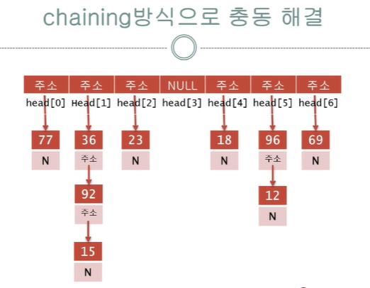

0. 해시 테이블
//0~9 사이의 정수 경우 boolean 배열 make-> 검색/삽입/삭제: 시간 복잡도 O(1)
//문제 1: 데이터 범위가 너무 큰 경우. 문제 2: 데이터가 정수가 아닌 경우->>이런 문제를 해결 하고자 해시 테이블 도입.
데이터 타입에 상관없이 원하는 범위의 정수로 매핑하자!

1. 용어 
    key: 고유한 입력값. 원본 데이터
    해시 테이블: 큰틀. 배열의 사이즈와  bucket을 가르킬 포인터를 have.
    Hash funtion(해시 함수): 임의의 길이의 key를 가급적 고유한 수의값(해시 테이블의 인덱스)으로 변환하는 함수. 해시 테이블 범위 내의 정수 인덱스로 변환  
    Bucket: 해시 함수가 반환한 인덱스에 해당하는 해시 테이블의 인덱스에 실제 데이터(Key-Value)를 저장하는 개별 공간
    hash value(해시 값): key가 hash funtion을 거쳐 반환되는 값.
    부하율(Load Factor): 전체 key개수/해시 테이블 전체 크기
    //해시 테이블의 메모리가 얼마나 채워졌는지를 나타내는 비율. 부하율이 1에 가까울수록 좋음. 단, 부하율이 해시 테이블 성능을 결정하는 유일한 지표는 될수 X(e.g.,)해시 테이블 크기가 7 && 체이닝 방식으로 0번 인덱스에만 7개의 key가 붙은 안좋은 해시 테이블: 7/7로 부하율이 1로 나옴. 
    재해싱(rehashing): 해시 함수를 수정하여 부하율이 1에 가까운 값이 되도록 하는것.

1. 해시 함수
    e.g.,)

    int hash(int key, int size)// size: 해시 테이블 크기.
    {
        return key % size;
    }

2. 충돌 해결 방법(충돌: 서로 다른 key을 매개로 받은 해시 함수가 같은 값을 반환== 고유한 수의 값이 겹치는 상황.) 
    
    2-1체이닝(chaining): 같은 해시 값을 갖는 요소를 연결 리스트로 관리. 
    2-1-1부하율 범위: a > 1 가능 (상한선 없음)
    

    2-2open_addressing: lienar probing(선형 탐사법)use. 충돌 발생시 다음 버킷이 비어 있는지 확인후, 비어 있다면 해당 버킷에 삽입.