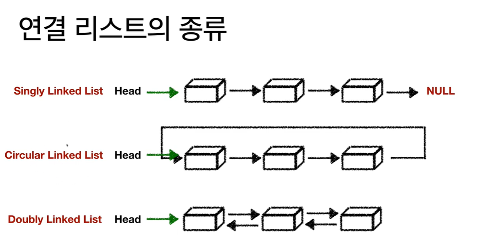

0. 
    0-1 Linked list의 종류:
    Singly linked List
    Circular Linked List 
    Double Linked List

    0-2 list의 특징:
    배열과 달리 어디가 첫번째 원소(노드) 인지 모름. so. 첫번째 노드의 주소를 저장하는 head가 필요.

<Singly Linked List>
 1. 특징   
    1-1: 일방향 으로 노드 연결됨.
    1-2: 시작 노드: Head. //head가 첫번째 노드의 주소를 저장.
         끝 : NULL
    1-3: 노드 새로 추가하면 Header 파일의 포인터가 추가된 노드를 가르키게됨.   
    1-4: 단일 연결 리스트에서 노드 추가의 시간 복잡도: O(1)
    1-5: 단일 연결 리스트에서 노드 순회의 시간 복잡도: 
    O(N);
 e.g.,)

 typedef struct ListNode{
    int data;
    struct ListNode* next;

 }ListNode;
 
 ListNode*insert_first(ListNode*head,int val)
 {
    ListNode*p=(ListNode*)malloc(sizeof(ListNode));

    p->data=val;
    p->next=head;
    head=p;

    return head;
 }

int main(int argc, const char* argv[]){

    ListNode *head=NULL;
    head=insert_first(head,1);//이렇게 반환값을 저장해줘야함. 

    
}

LinkedNode* delete_first(Linked Node* head){
if(head==NULL){return NULL;}

LinkedNode*removed=head;

head=removed->next;

free(removed);  

return head;
}

void printf_list(ListNode*head){

    for(ListNode*p=head; p!=NULL; p=p->next){

        printf("%d\n",p->data);

    }
    
}

<Doubly Linked List>
 0. 
    0-1:Singly Linked List와 차이점
    단일에선 head가 가르키는 노드가 변화. but 이중에선 head가 가르키는 노드는 고정. (해당 노드는 맨앞 알려주는 기능"만"함. so 데이터 안 담음.)

    0-2: 노드의 오른쪽, 왼쪽. 총 dobule pointer가 있음.
1. 구조

 e.g.,)

typedef int element;

typedef struct DListNode{
int data;
DListNode* llink;
DListNode* rlink;
}DListNode;

void init_List(DListNode* phead) {

	phead->llink = phead;
	phead->rlink = phead;

}

void dinsert_first(DListNode* before, element val)
{
	DListNode* newnode = (DListNode*)malloc(sizeof(DListNode);

	newnode->data = val;
	newnode->llink = before;
	newnode->rlink = before->rlink;
	
	before->rlink->llink = newnode;//이렇게 타고타고 넘어가는거 이해해야함.
	before->rlink = newnode;
}

void delete_first(DListNode *head, DListNode *removed){

if(head==removed){return;}

removed->llink->rlink=removed->rlink;
removed->rlink->llink=removed->llink;
free(removed);
} 

int main(int argc, const char* argv[]) {
	DListNode* head = (DListNode*)malloc(sizeof(DListNode));
	init_List(head);
    dinsert_first(head,3);

	return 0;
}
