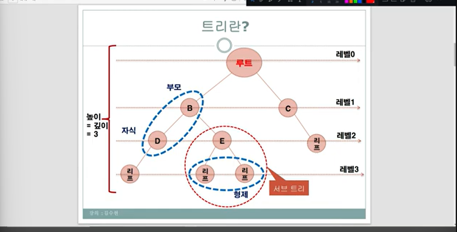
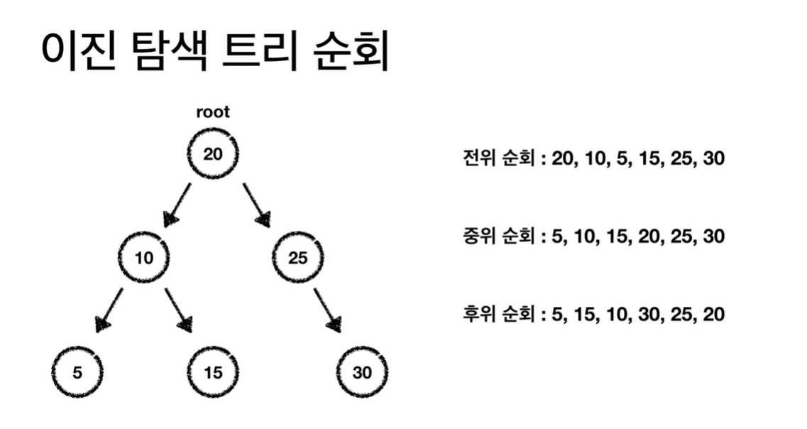

0. 트리 
 0-1 Tree용어
  root node: 최상위 노드
  parent node: 부모 노드
  child node: 자식 노드
  leaf node: 말단 노드 //자식노드 하나도 없는 노드.
  서브 트리: 트리 안의 **트리**(==개별 트리).
  레벨: 루트를 0단계로 해서 아랫 세대로 갈수록 +1.
  트리의 높이(깊이): 최대 레벨의 차수.
  간선(edge): 노드와 노드간의 길.

  0-2 Binary Tree(이진 트리) 용어
    complete binary tree(완전 이진 트리): 최대(마지막) 레벨을 제외하고 모든 레벨은 노드로 가득 차야함. && 마지막 레벨은 왼쪽 부터 차례로 노드가 채워져 있음.
    //complete binary tree: 
    자식이 있는 노드(부모 노드)수=전체 노드 수/2
    full binary tree(정 이진 트리): 모든 노드가 0or2의 자식
    perfect binary tree(포화 이진 트리): 모든 leaf의 레벨이 같음. && 모든 노드가 채워져야함. //피라미드 모양.
    complete binary tree이기도 함.
  
 
 0-3 Binary Search Tree 용어
    정의: 부모 왼쪽은 부모보다 작은값. 부모 오른쪽은 부모보다 큰값.중복값 허용X
    최댓값/최솟값:오른쪽 끝, 왼쪽 끝에 위치
    원소 삽입: 삽입할 데이터를 규칙에 따라 내려가다가 NULL인 곳에다 삽입 
    원소 삭제: 아래 네 가지 경우 고려.//원소 삭제 함수는  삭제되는 노드를 부모에게 return 하는 식으로. 
        1 자식 노드X: 삭제하고 부모 자식한테 NULL을 반환.
        2 왼쪽 자식노드만 존재: 임시변수로 왼쪽 자식 주소 저장. 삭제할 노드 삭제하고 임시변수를 삭제한 노드의 부모 노드한테 반환.
        3 오른쪽 자식 노드만 존재: 임시변수로 오른쪽 자식 주소 저장. 삭제할 노드 삭제하고 임시변수를 삭제한 노드의 부모 노드한테 반환.
        4 자식 노드 둘다 존재: 삭제할 노드의 왼쪽 자식**들**중에서 가장큰 값을 삭제할 노드 자리에다 넣고. 그 왼쪽 최대 자식을 삭제. 
     2개의 트리 순회 방식을 보고 원본 트리 복원:
     이떄 무조건 중위 순회 방식이 포함돼야함.
 
 0-3 Tree와 그래프의 차이: 순환의 여부

1. Binary tree vs Binary search tree:
 1-1기본 정의:
    Binary tree:각 노드가 최대 2개의 자식 노드를 가지는 트리
    BInary search tree: 이진 트리에 정렬 규칙이 추가된 트리
 1-2정렬 규칙:
     Binary tree:없음 (데이터가 무작위로 배치될 수 있음)
     Binary search tree: 왼쪽 자식(부모 보다 작은 데이터일때 부모의 왼쪽 으로.) < 부모 < 오른쪽(왼쪽과 반대로 적용.)

2. Tree_Travasal// 부모를 어디다 두느냐에 따라 전위or중위or 후위.
    Preoder Travasal: 전위 순회//최상위 노드가 먼저 출력(탐색)됨.순서: 부 왼 오
    Inorder Travasal: 중위 순회//최상위 노드가 중간에 출력(탐색)됨. 오름 차순으로 출력(탐색)하는 것과 같은 결과.
    순서: 왼 부 오
    (==중위 순회가 잘되면 오름차순으로 데이터가 나와야함!)
    Postorder Travasal: 후위 순회//최상위 노드가 마지막에 출력(탐색)됨. 순서: 왼 오 부 
중위: 1 5 3 4 2 11 6 9 7 10
후위: 1 3 5 2 4 6 10 7 9 11
전위: 11 4 5 1 3 2 9 6 7 10
    
3. sub Tree 개념: 
큰 트리 관점에서는 자식 노드이지만, 서브 트리 관점에서는 해당 노드가 최상위 노드가 되어 일을 처리.
    e.g.,)

    typedef struct TreeNode {

        int key;
        struct TreeNode* left, * right;

    }TreeNode;

    TreeNode* newnode(int item){

        TreeNode* temp = (TreeNode*)malloc(sizeof(TreeNode));
        temp->key = item;
        temp->left = temp->right = NULL;

        return temp;
    }

    TreeNode* insertnode(TreeNode* node, int key) {
        if (node == NULL) { return newnode(key); }

        if (key < node->key) 
            node->left=insertnode(node->left, key);//재귀 호출

        else if (key > node->key) { return insertnode(node->right, key); }
        node->right= insertnode(node->right, key);
        return node;
    }

    TreeNode* search(TreeNode* node, int item) {

        if (node == NULL)return NULL;

        if (node->key == item) return node;

        if (node->key > item)
            return search(node->left, item);
        if (node->key < item)
            return search(node->right, item);

    } //array로 하면 인덱스 전체를 순회해야하지만 tree로 하면 절반으로 줄어듬.(array vs tree)

    void inorder(TreeNode*root){

        if(root){

            inorder(root->left);
            printf(" %d",root->key);
            inorder(root->right);

        }
}//중위 순회 구현

typedef stcut node
{
    int valte;
    struct node *left;
    struct node * right;

}node;

void travasal_mid(node* root)
{

    if(root)
    {
        travasal_mid(root->left);
        printf("%d ",root->value);
        travasal_mid(root->right);

    }
}

