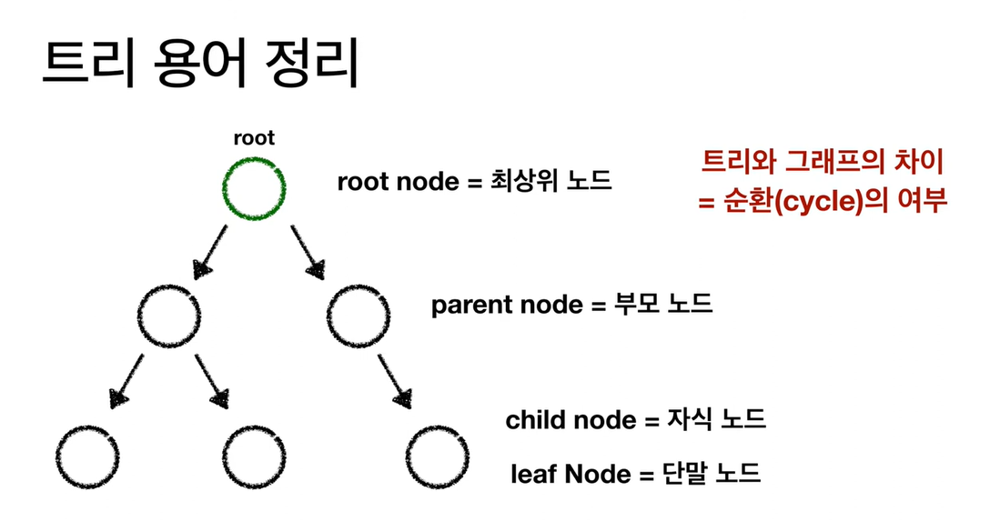
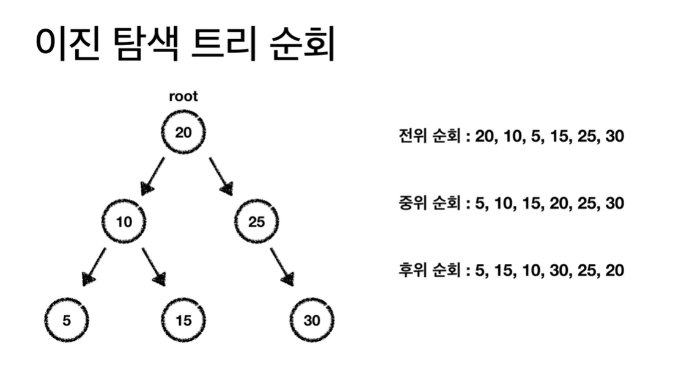

0. 트리 
 0-1 용어
  root node: 최상위 노드
  parent node: 부모 노드
  child node: 자식 노드
  leaf node: 단말 노드 //자식노드가 0
  
 
 0-2 Tree와 그래프의 차이: 순환의 여부

1. Binary tree vs Binary search tree:
 1-1기본 정의:
    Binary tree:각 노드가 최대 2개의 자식 노드를 가지는 트리
    BInary search tree: 이진 트리에 정렬 규칙이 추가된 트리
 1-2정렬 규칙:
     Binary tree:없음 (데이터가 무작위로 배치될 수 있음)
     Binary search tree: 왼쪽 자식(부모 보다 작은 데이터일때 부모의 왼쪽 으로.) < 부모 < 오른쪽(왼쪽과 반대로 적용.)

2. Travasal(순회)
    Preoder Travasal: 전위 순회//최상위 노드가 먼저 출력(탐색)됨.
    Inorder Travasal: 중위 순회//최상위 노드가 중간에 출력(탐색)됨. 오름 차순으로 출력(탐색)하는 것과 같은 결과.(==중위 순회가 잘되면 오름차순으로 데이터가 나와야함!)
    Postorder Travasal: 후위 순회//최상위 노드가 마지막에 출력(탐색)됨.

    
3. sub Tree 개념: 
큰 트리 관점에서는 자식 노드이지만, 서브 트리 관점에서는 해당 노드가 최상위 노드가 되어 일을 처리.
    e.g.,)

    typedef struct TreeNode {

        int key;
        struct TreeNode* left, * right;

    }TreeNode;

    TreeNode* newnode(int item){

        TreeNode* temp = (TreeNode*)malloc(sizeof(TreeNode));
        temp->key = item;
        temp->left = temp->right = NULL;

        return temp;
    }

    TreeNode* insertnode(TreeNode* node, int key) {
        if (node == NULL) { return newnode(key); }

        if (key < node->key) 
            node->left=insertnode(node->left, key);//재귀 호출

        else if (key > node->key) { return insertnode(node->right, key); }
        node->right= insertnode(node->right, key);
        return node;
    }

    TreeNode* search(TreeNode* node, int item) {

        if (node == NULL)return NULL;

        if (node->key == item) return node;

        if (node->key > item)
            return search(node->left, item);
        if (node->key < item)
            return search(node->right, item);

    } //array로 하면 인덱스 전체를 순회해야하지만 tree로 하면 절반으로 줄어듬.(array vs tree)

    void inorder(TreeNode*root){

        if(root){

            inorder(root->left);
            printf(" %d",root->key);
            inorder(root->right);

        }
}//중위 순회 구현